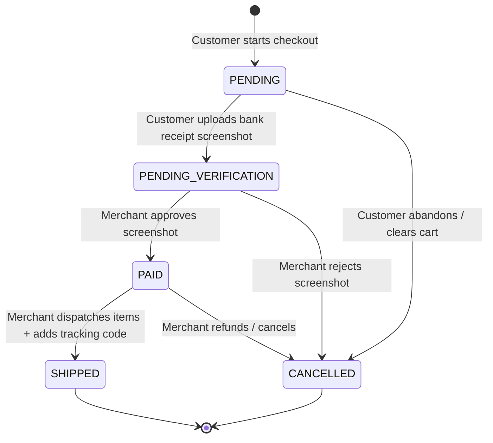

# STATE_MACHINE.md - Order State Management

This document details the Order Lifecycle State Machine, transitions, validation rules, and transactional side effects.

---

## 1. Order Status State Chart

Orders follow a strict state progression path to prevent double-charging, invalid shipments, or incorrect metrics:



---

## 2. State Transition Specification Table

| From State | To State | Trigger | Initiator | Database & Side Effects |
| :--- | :--- | :--- | :--- | :--- |
| `PENDING` | `PENDING_VERIFICATION` | Upload receipt photo | Customer (Bot) | Save image path; decrease product inventory levels; notify Merchant. |
| `PENDING` | `CANCELLED` | Abort checkout / timeout | Customer (Bot) | Order records deleted or marked as inactive. |
| `PENDING_VERIFICATION` | `PAID` | Confirm bank receipt | Merchant (Dashboard) | Generate PDF Invoice; upload PDF; send confirmation message + PDF to Customer. |
| `PENDING_VERIFICATION` | `CANCELLED` | Reject bank receipt | Merchant (Dashboard) | Return reserved items back to product inventory stock count; send rejection alert to Customer. |
| `PAID` | `SHIPPED` | Dispatch packages | Merchant (Dashboard) | Append tracking number to database; dispatch tracking notification link. |

---

## 3. Strict Transition Constraints

The database repository and status controller must validate state changes before execution:
- **No Backward Transitions**: Once an order is updated to `PAID`, it can never transition back to `PENDING` or `PENDING_VERIFICATION`.
- **Shipped Protection**: Once an order reaches `SHIPPED`, its status is terminal. The database rejects attempts to modify it to `CANCELLED` or `PAID`.
- **Inventory Locking**:
  - Stock is reserved when the order moves to `PENDING_VERIFICATION`.
  - If the transaction is approved (`PAID`), the inventory change becomes permanent.
  - If rejected (`CANCELLED`), the service layer must run a database transaction restoring stock:
    ```typescript
    await prisma.$transaction([
      prisma.order.update({ where: { id: orderId }, data: { status: "CANCELLED" } }),
      ...items.map(item => 
        prisma.product.update({
          where: { id: item.productId },
          data: { stock: { increment: item.quantity } }
        })
      )
    ]);
    ```
